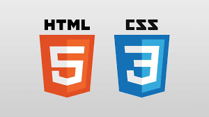
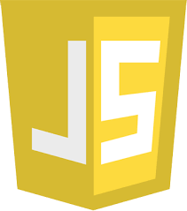

# Portfolio

## Description

This application is designed to function as a Family Hub; a "One Stop Shop" for all a family's need. You can check out a calendar and make important additions as well as views to Grocery Lists, Bill, and more.

### Technologies Used

* HTML
* CSS
* Firebase
* JavaScript
* React
* Responsive Design  

---

 **HTML, CSS, Flexbox**
  
This project was made utilizing a combination of coding with all of these technologies.

 **Firebase**

This project was made utilizing Firebase as the backend bridge to store the data.

 **JavaScript**

This project was made utilizing JavaScript. Several functions and variables were used to execute actionable features.

**React**

This project utilized React accompanied with Hooks to manage state.

**Responsive Design**

This project required functionality of the website at all resolutions to include more than 1400 pixels all the way down and adaptive to a screen size of 350 pixels.

---

### The link below will lead directly to the project online:

[Deployment Link](https://arc.netlify.app)

